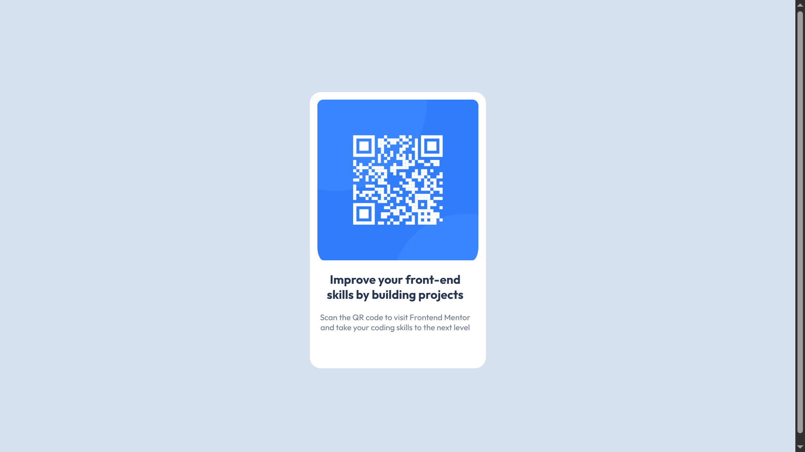

# Frontend Mentor - QR code component solution

This is a solution to the [QR code component challenge on Frontend Mentor](https://www.frontendmentor.io/challenges/qr-code-component-iux_sIO_H). Frontend Mentor challenges help you improve your coding skills by building realistic projects. 

## Table of contents

- [Overview](#overview)
  - [Screenshot](#screenshot)
- [My process](#my-process)
  - [Built with](#built-with)
  - [What I learned](#what-i-learned)
  - [Continued development](#continued-development)
  - [AI Collaboration](#ai-collaboration)
- [Author](#author)
- [Acknowledgments](#acknowledgments)

## Overview

### Screenshot

## My process

### Built with

- Semantic HTML5 markup
- CSS custom properties
- Flexbox
- Mobile-first workflow
framework
- [Styled Components](https://styled-components.com/) - For styles

### What I learned

I mostly learned the alignment in this project.How effectively can I align div, div inside div,etc. Also I learned to use google fonts in my project. Mostly done my me.

### Continued development

Mostly I want to focus in alignments, and  proper responsive layouts. How can I achieve those with as few lines as possible is my primary goal.

### AI Collaboration

I used chatGPT for 1 reason, I was not able to center my .container ;]

## Author

- User - [Agent Sqaure]
- Frontend Mentor - [@agentsquare](https://www.frontendmentor.io/profile/AgentSquareOfficial)

## Acknowledgments

I took some help(7% or so), from this Yt channel: Mr Coder. Amazing guy, cool techniques used.
